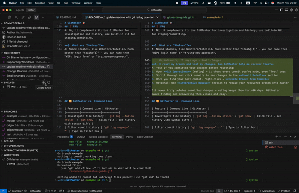

# GitMaster 🎯

> **Investigate your Git history like a detective. Manage stashes like a pro.**

[**🌐 Visit Website**](https://git-master.com)

Stop wrestling with Git commands. GitMaster brings powerful Git investigation tools and visual stash management (Shelves) directly into VS Code. Beautiful visualizations, author color-coding, and intuitive controls make understanding your codebase effortless.

Perfect for code investigators, reviewers, and developers who need to track down changes, understand history, and manage work-in-progress efficiently.

## ✨ Key Features

### 🔍 **Git Investigation Tools**

**Inline Git Blame - Context Where You Need It**
See the history of any line of code directly in your editor.
- 👤 **Who & When**: See author and relative time inline as you type.
- 🖼️ **Rich Tooltip**: Hover to see the author's avatar, full message, and date.
- 🖱️ **Interactive**: Click to open detailed commit view and see the full diff.
- 🔄 **Smart Diff**: Works in comparison views to let you step back through history.
- 🏷️ **Rename Aware**: Tracks file history even across renames.

**✨ Explain with AI - Understand Changes Instantly**  
Don't just see the code changes—understand *why* they happened.
- 🤖 **One-Click Analysis**: Click the sparkle icon in Commit Details.
- 📋 **Auto-Copy**: Copies the commit message and full diff to your clipboard.
- 🧠 **Context-Rich**: Prompts your AI assistant (Cursor, Copilot, etc.) to explain the "what" and "why" of the change.

**File History - Track Every Change**  
Open any file and see its complete commit history with syntax-highlighted diffs.
- 🎨 Color-coded by author - spot patterns instantly
- 🔍 Click to view exact changes with syntax highlighting
- 🔎 Filter commits by message
- 📋 Copy commit IDs and file paths
- ⚡ Auto-updates when switching files

**Git Graph - Visualize Your Repository**  
See your commit history as an interactive graph with branches, tags, and merge visualization.
- 🌳 Visual branch flow from top to bottom
- 🏷️ Branches and tags displayed on commits
- 🔍 Click any commit to inspect details
- 🎯 Zoom controls for large histories
- 📊 Shows merged branches and relationships

**Git Log - Search & Investigate**  
Repository timeline with powerful filtering and operations.
- 🔎 Filter commits by message across entire history
- 🎨 Author color-coding
- 📜 Load more commits on demand (50 at a time)
- 🍒 Cherry-pick to current branch
- 🔄 Revert in new branch (safe)
- 🌿 Create branches from any commit

**Git Operations (Reflog) - Time Travel**  
Every action you've taken, visualized with icons. Jump to any point in history.
- 📝 Commits • 🌿 Checkouts • ☁️ Pulls • 🔀 Merges • 📚 Rebases • ❌ Resets

### 🏗️ **Git Worktrees - Multi-Context Workflow**

Work on multiple branches simultaneously without switching contexts or stashing.
- 📂 **Manage Worktrees** - View, create, and remove worktrees visually
- 🚀 **Quick Switch** - Open any worktree in a new window with one click
- 🛡️ **Safe Management** - Prevents accidental deletion of main or active worktrees
- 🧹 **Auto-Prune** - Clean up stale worktree entries easily

### 📦 **Shelves - WebStorm-Style Stash Management**

Save your WIP changes with meaningful names. No more "stash@{0}" confusion.

- ✍️ **Named stashes** - "WIP: login form" beats "stash@{0}"
- 👁️ **Preview changes** - see diffs before applying
- 📊 **File counts** - know what's in each shelf
- ⚠️ **Smart warnings** - prevents data loss
- 🗂️ **Include untracked files** - stash everything
- 🔄 **Apply or Pop** - your choice

### 🌿 **Branch Management**

Work efficiently with team repositories. Focus on what matters.

- 👤 **My Branches filter** - hide team noise
- 🔍 **Filter by author** - track specific developers
- 📌 **Pin important branches** - persistent across sessions
- 🎨 **Color-coded** - same author, same color
- ☁️ **Remote branch checkout** - one click
- ➕ **Create & delete** visually
- 📅 **Sorted by activity** - recent first

## ⚙️ Configuration

You can customize GitMaster in VS Code Settings (**Cmd+','** or **Ctrl+','**). Search for "GitMaster" to see all available options.

**Inline Git Blame**
- `gitmaster.blame.enabled` (default: `true`)  
  Toggle inline Git blame annotations on/off.

**Git Operations View**
- `gitmaster.views.showGitOperations` (default: `true`)  
  Toggle the Git Operations (Reflog) view in the sidebar.

### 🤝 MCP (Cursor integration)

GitMaster can expose a local **MCP server** (running inside the extension host) so Cursor can call GitMaster tools.

> ⚠️ **MCP is disabled by default.** You must enable it first in settings.

**How to enable MCP:**
1. Open VS Code Settings (**Cmd+,** or **Ctrl+,**)
2. Search for `gitmaster.mcp.enabled`
3. Check the box to enable MCP
4. Run the VS Code command **`GitMaster: Install MCP in Cursor`** to configure Cursor

**Settings:**
- `gitmaster.mcp.enabled` (default: `false`) - Enable the MCP server
- `gitmaster.mcp.port` (default: `8765`) - Port for the MCP server

Then in Cursor, use GitMaster MCP tools like **Commit Explain**, **Show Git Graph**, **Shelves**, **File Experts**, and **File History**.

## 🎨 Why GitMaster?

**🔍 Built for Code Investigation**  
Find when bugs were introduced, who changed what, and why. Filter, search, and visualize your way to answers.

**📦 WebStorm-Style Shelves**  
Named stashes that actually make sense. Save WIP work with context, not cryptic stash@{0} references.

**🌈 Author Color-Coding**  
Same author = same color everywhere. Spot patterns across File History, Branches, Git Log, and Graph instantly.

**🖱️ Visual & Interactive**  
Click to explore. Right-click for operations. No terminal commands to memorize.

**🛡️ Safe by Default**  
Warns before destructive actions. Detects conflicts. Validates inputs. Shows what will happen.

## 🚀 Quick Start

1. **Install** GitMaster from the Extensions panel
2. **Open** any Git repository
3. **Click** the Git Master icon in the sidebar (Activity Bar)
4. **Explore!** All your Git data is now visual and interactive

> **💡 Tip:** No configuration needed. GitMaster works out of the box with any Git repository.

## 📖 Investigation Workflows

### 🔍 "When did this bug get introduced?"
1. Open the buggy file → File History
2. Filter commits by keywords (e.g., "auth")
3. Click commits to see syntax-highlighted diffs
4. **New**: Click "✨ Explain with AI" to get an instant summary of complex changes.
5. Find the culprit commit

### 🌳 "How did these branches merge?"
1. Git Log → Click Git Graph icon
2. See visual branch flow and merge points
3. Click any commit to inspect details
4. Zoom in/out for clarity

### 🕵️ "Who worked on authentication?"
1. Branches → Filter by author
2. Or Git Log → Filter by "auth"
3. See all related commits color-coded

### 📦 "Save WIP to investigate a bug"
1. Shelves → Click **+**
2. Name it "WIP: feature-x"
3. Investigate and fix the bug
4. Pop your shelf to resume work

### 🍒 "Apply this fix to another branch"
1. Find commit in Git Log or Graph
2. Right-click → Cherry-pick
3. Auto-conflict detection guides you

### 🏗️ "Work on a hotfix while in the middle of a feature"
1. Worktrees → Click **+**
2. Name folder "hotfix-login" and branch "hotfix/login-bug"
3. Click the folder icon to open a new window
4. Fix bug in isolation without touching your current work
5. Close window and remove worktree when done

## 💻 System Requirements

- **Git** installed and in your PATH
- **VS Code** 1.85.0 or newer
- Any **Git repository**

That's it! GitMaster works with any Git repo - no additional setup required.

## ❓ FAQ

**Q: How is this different from Git Graph extensions?**  
A: GitMaster combines investigation tools (file history, filtering, author tracking), visual graph, AND WebStorm-style shelves in one extension. It's designed for investigating code, not just viewing commits.

**Q: Does it work with large repositories?**  
A: Yes! Load-more functionality (50 commits at a time) and filtering keep it fast even with thousands of commits.

**Q: Will this work with GitHub/GitLab/Bitbucket/Azure DevOps?**  
A: Yes! Works with any Git repository, regardless of hosting.

**Q: Does it replace VS Code's built-in Git?**  
A: No, it complements it. Use GitMaster for investigation and history, use built-in Git for staging/committing.

**Q: What are "Shelves"?**  
A: Named stashes, like WebStorm/IntelliJ. Much better than "stash@{0}" - you can name them "WIP: login form" or "trying-new-approach".

**Q: I reset my branch and lost my changes. Can GitMaster help me recover them?**  
A: Yes! If you committed your changes before resetting:
1. Open **Git Operations** (reflog) - it shows every commit you've made, even "lost" ones
2. Scroll through and click commits to see changes in the **Commit Details** section
3. Once you find your lost commit, right-click → **Create Branch from Commit**
4. Optional: Use **Interactive Rebase** section to rebase your recovered branch onto master

Git never truly deletes committed changes - reflog keeps them for ~90 days. GitMaster makes finding and recovering them visual and easy.

## 🆚 GitMaster vs. Command Line

| Feature | Command Line | GitMaster |
|---------|-------------|-----------|
| Investigate file history | `git log --follow <file>` + `git show` | Click file → see history with syntax diffs |
| Filter commit history | `git log --grep="..."` | Type in filter box |
| Visualize branch graph | `git log --graph --all` | Interactive graph with zoom & click |
| Named stashes | `git stash push -m "name"` | Click + → type name |
| Filter branches by author | `git branch -a \| grep ...` + scripting | Click 👤 icon |
| View reflog | `git reflog` → parse text | Timeline with icons & operations |
| Manage worktrees | `git worktree list/add/remove` | Visual list, one-click open & create |

**GitMaster makes Git investigation visual, fast, and safe.**

## 🐛 Found a Bug?

[Open an issue](https://github.com/razyahkovnia/gitmaster/issues) with: what you tried, what happened, VS Code version, Git version.

## 🌟 Love GitMaster?

⭐ Star on [GitHub](https://github.com/razyahkovnia/gitmaster) • ✍️ [Leave a review](https://marketplace.visualstudio.com/items?itemName=razyahkovnia.gitmaster&ssr=false#review-details) • 📢 Tell your team

## 📝 License

MIT License - Free to use in personal and commercial projects.

---

**Made with ❤️ for code investigators and Git power users**

*Because understanding your codebase shouldn't require a terminal degree*

[Report Bug](https://github.com/razyahkovnia/gitmaster/issues) • [Request Feature](https://github.com/razyahkovnia/gitmaster/issues) • [🌐 Website](https://git-master.com)

